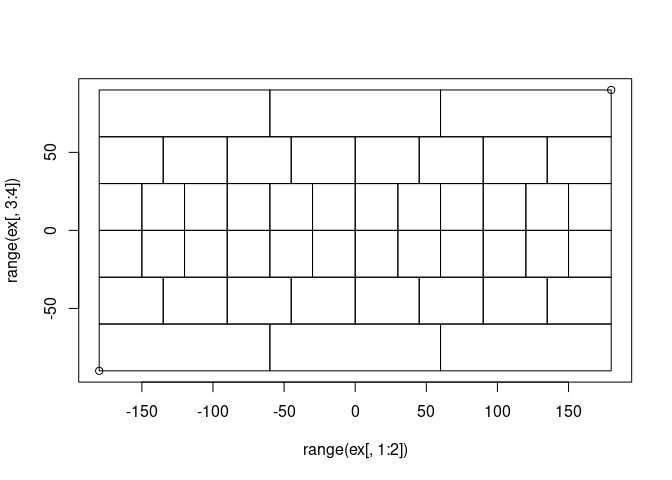
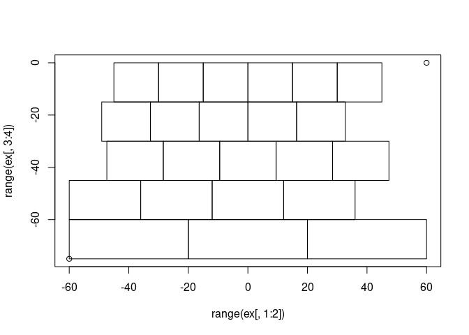
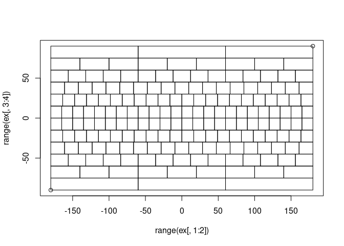
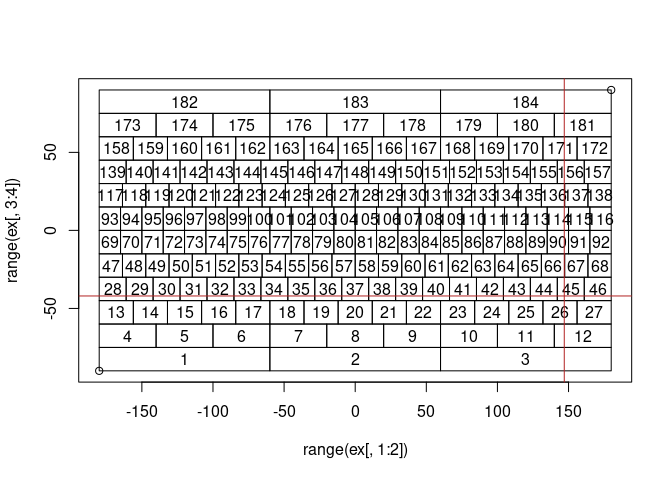
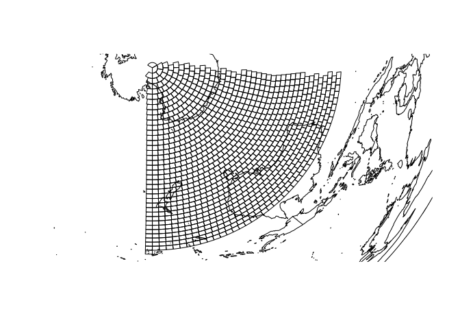

<!-- README.md is generated from README.Rmd. Please edit that file -->

# L3bin

<!-- badges: start -->

[](https://github.com/hypertidy/L3bin/actions/workflows/R-CMD-check.yaml)
<!-- badges: end -->

The goal of L3bin is to provide the [Integerized Sinusoidal Binning
Scheme](https://oceancolor.gsfc.nasa.gov/docs/format/l3bins/) used by
NASA’s Ocean Biology processing Group for Level 3 data.

## Installation

You can install the development version of L3bin from
[GitHub](https://github.com/) with:

``` r
# install.packages("devtools")
devtools::install_github("hypertidy/L3bin")
```

## Example

This is a basic example which shows you how to solve a common problem:

``` r
library(L3bin)
## basic example code
nr <- 6
bins <- L3bin(nr)
ex <- extent_from_bin(1:bins$totbins, nr)

plot(range(ex[,1:2]), range(ex[,3:4]))
rect(ex[,1], ex[,3], ex[,2], ex[, 4])
```



``` r


nr <- 12
bins <- L3bin(nr)
lbins <- crop_bins(bins, extent = c(-20, 30, -60, -10))
ex <- extent_from_bin(lbins, nr)

plot(range(ex[,1:2]), range(ex[,3:4]))
rect(ex[,1], ex[,3], ex[,2], ex[, 4])
```



``` r

ex <- extent_from_bin(1:bins$totbins, nr)

plot(range(ex[,1:2]), range(ex[,3:4]))
rect(ex[,1], ex[,3], ex[,2], ex[, 4])
```



Get lonlat from bin and vice versa.

``` r

plot(range(ex[,1:2]), range(ex[,3:4]))
rect(ex[,1], ex[,3], ex[,2], ex[, 4])

text(lonlat_from_bin(1:bins$totbins, nr), lab = 1:bins$totbins)
abline(v = 147, h = -42, col = "firebrick")
```



``` r

bin_from_lonlat(147, -42, nr)
#> [1] 45
```

Using the crop from above, reproject after densifying (safely) with sf

``` r
nr <- 96
bins <- L3bin(nr)
ex <- extent_from_bin(1:bins$totbins, nr)
lbins <- crop_bins(bins, extent = c(100, 180, -90, -20))
ex <- extent_from_bin(lbins, nr)

## generally sf a bad idea because 4 numbers xmin,xmax,ymin,ymax become 10
## and we could use mesh3d or similar from silicate (SC0), but here's an example
## just to show a projected set of the bins
to_sf <- function(ex, crs = "OGC:CRS84") {
  idx <- c(1, 2, 2, 1, 1, 
           3, 3, 4, 4, 3)
  proto <- sf::st_polygon(list(cbind(0, c(1:4, 1))))
  sf::st_sfc(lapply(split(t(ex), rep(1:nrow(ex), each = 4L)), 
         function(.x) {
           proto[[1L]][] <- .x[idx]
           proto
         }), crs = crs)
}
sf::sf_use_s2(FALSE)
#> Spherical geometry (s2) switched off
segit <- function(x, dx = 111111) {
  crs <- sf::st_crs(x)
  sf::st_set_crs(sf::st_segmentize(sf::st_set_crs(x, NA), dx), crs)
}  
prj <- "+proj=laea +lat_0=-80"
## dx is 1 degree in straightforward sense
plot(sf::st_transform(segit(to_sf(ex), 11111), prj))
mm <- reproj::reproj(do.call(cbind, maps::map(plot = FALSE)[1:2]), prj, source = "+proj=longlat")[,1:2]
lines(mm)
```



## Code of Conduct

Please note that the L3bin project is released with a [Contributor Code
of
Conduct](https://contributor-covenant.org/version/2/1/CODE_OF_CONDUCT.html).
By contributing to this project, you agree to abide by its terms.
