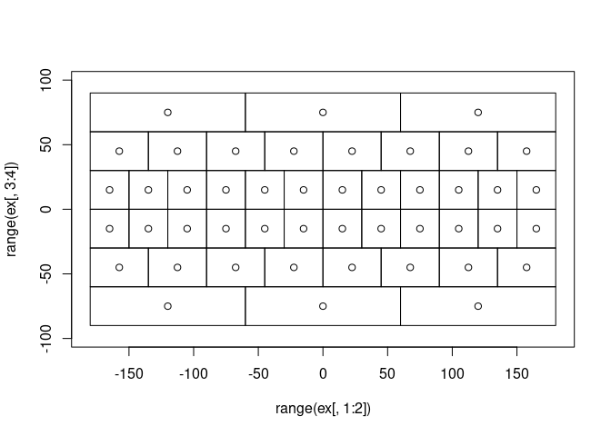

<!-- README.md is generated from README.Rmd. Please edit that file -->

# L3bin

<!-- badges: start -->

[](https://github.com/hypertidy/L3bin/actions/workflows/R-CMD-check.yaml)
<!-- badges: end -->

The goal of L3bin is to provide the [Integerized Sinusoidal Binning
Scheme](https://oceancolor.gsfc.nasa.gov/docs/format/l3bins/) used by
NASA’s Ocean Biology processing Group for Level 3 data.

## Installation

You can install the development version of L3bin from
[GitHub](https://github.com/) with:

``` r
# install.packages("devtools")
devtools::install_github("hypertidy/L3bin")
```

## Example

This is a basic example which shows you how to solve a common problem:

``` r
library(L3bin)
## basic example code
nr <- 6
bins <- L3bin(nr)
ex <- extent_from_bin(1:bins$totbins, nr)

plot(range(ex[,1:2]), range(ex[,3:4]))
rect(ex[,1], ex[,3], ex[,2], ex[, 4])
```



``` r


nr <- 12
bins <- L3bin(nr)
lbins <- crop_bins(bins, extent = c(-20, 30, -60, -10))
ex <- extent_from_bin(lbins, nr)

plot(range(ex[,1:2]), range(ex[,3:4]))
rect(ex[,1], ex[,3], ex[,2], ex[, 4])
```


``` r

ex <- extent_from_bin(1:bins$totbins, nr)

plot(range(ex[,1:2]), range(ex[,3:4]))
rect(ex[,1], ex[,3], ex[,2], ex[, 4])
```


Get lonlat from bin and vice versa.

``` r

plot(range(ex[,1:2]), range(ex[,3:4]))
rect(ex[,1], ex[,3], ex[,2], ex[, 4])

text(lonlat_from_bin(1:bins$totbins, nr), lab = 1:bins$totbins)
abline(v = 147, h = -42, col = "firebrick")
```


``` r

bin_from_lonlat(147, -42, nr)
#> [1] 45
```

No reprojecting yet, need to check some stuff and probably densify the
edges … there is densify funs in sosoc/croc WIP

## Code of Conduct

Please note that the L3bin project is released with a [Contributor Code
of
Conduct](https://contributor-covenant.org/version/2/1/CODE_OF_CONDUCT.html).
By contributing to this project, you agree to abide by its terms.
